Fernerkundung in der Landschaftsplanung - Tag 6 - Überwachte Klassifikation in R - Teil 2

**Autoren:** Dieses Tutorial wurde von Fabian Fassnacht entwickelt.

### Lernziele

In diesem Teil des Tutorial lernen Sie wie sie die Ergebnisse der Basisklassifikation der letzten Woche verbessern können indem anstelle einer einzelnen, mehrere Satellitenbildszenen verwendet werden. Darüber hinaus werden wir lernen, wie wir mit Hilfe eines unabhängigen Referenzdatensatzes das Klassifikationsergebnis validieren können und uns sowohl eine normale und eine flächennormaliserte Konfusionmatrix anzeigen lassen können. Als letzten Schritt werden wir aus den Ergebnissen der überwachten Klassifikation eine binäre Karte ableiten, die versiegelte und unversiegelte Flächen darstellt.

Nach Absolvieren des Tutorials, sind Sie in der Lage eigenständig eine Pixel-basierte Klassifikation mit einem Satellitenbild-Stapel durchzuführen und diese mit einem dem aktuellen Wissensstand entsprechenden Validierung qualitativ bewerten zu können.

### Daten

Die für das Tutorial benötigten Sentinel-2 Daten und Vektordaten finden Sie hier:

https://drive.google.com/drive/folders/1IQPJTlW2SKx1sOYTKBII3vTHnofXg1xE?usp=sharing

Im Ordner finden sich 3 Sentinel-2 Satellitenbildszenen, die bereits als GeoTIFF-Dateien aufbereitet sind. Dazu finden Sie die Vektor-Trainingsdaten (Punkte) von letzter Woche, sowie einen zusätzlichen Validierungsdatensatz (ebenfalls eine Vektordatei mit Punkten). 

Die Trainingsdaten beinhalten 25 Trainingsdatenpunkte für jede der 7 Landbedeckungsklassen, die Validierungsdaten enthalten 30 (andere) Punkte pro Landbedeckungsklasse.

##  Teil 1 - Erstellen eines Satellitenbildstapels in R

Im ersten Schritt des Tutorials versuchen wir unser Klassifikationsergebnis von letzter Woche zu verbessern. Es gibt verschiedene Wege eine überwachte Landbedeckungsklassifikation zu verbessern. Der vermutlich einfachste und vielversprechendste Weg ist es dem Klassifikationsalgorithmus mehr Informationen zur Verfügung zu stellen. Dies bedeutet in unserem Fall, dass wir anstelle unserer einzelnen Sentinel-2 Szene einfach mehrere Sentinel-2 Szenen von unterschiedlichen Zeitpunkten im Jahr verwenden. Wir können vermuten, dass die zusätzliche saisonale Information dabei helfen wird, manche Klassen besser auseinanderzuhalten.

Wir starten zuerst RStudio und laden dann die benötigten Pakete. Sollten bestimmte Pakete noch nicht installiert sein, so installieren wir diese wie bereits in früheren Tutorials gelernt.
	
	require(terra)
	require(e1071)
	require(matrixStats)
	require(randomForest)
	require(RStoolbox)
	require(factoextra)
	require(caret)

Anschließend wechseln wir das Arbeitsverzeichnis in den Ordner in dem wir die Daten für das heutige Tutorial gespeichert haben und lassen uns mit dem "list.files()" Befehl alle Daten anzeigen, die im Ordner liegen:
	
	setwd("E:/188_BOKU/02_Lehre/OEKB100130_Remote_Sensing_Landscape_Planning/02_Uebungen/Tag_6/Daten")
	list.files()

Als nächsten Schritt laden wir die drei Satellitenbilder und die zwei Vektordateien in R:

	# Das ist unser ursprüngliches Bild
	s2_winter <- rast("Sentinel_2.tif")
	# Das sind die zwei neuen Bilder
	s2_spring <- rast("Sentinel_2_2025_06_10.tif")
	s2_summer <- rast("Sentinel_2_2025_08_19.tif")

	ref <- vect("Referenzdaten.gpkg")
	val <- vect("Validierung.gpkg")

Wir können uns die Landbedeckungsinformationen in den Vektordateien ansehen in dem wir folgenden Code ausführen:
	
	table(val$class)
	table(ref$class)

Dies führt zu der Ausgabe, die in Abbildung 1 dargestellt ist.

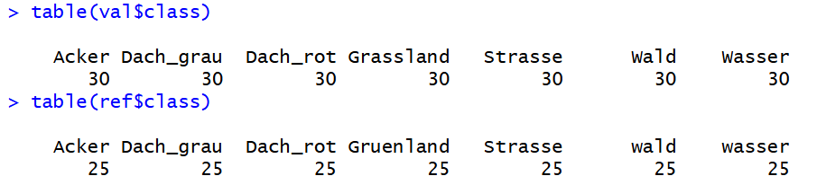

Wir sehen, dass die beiden Dateien prinzipiell dieselben Landbedeckungsklassen enthalten, dass die genauen Schreibweisen und Bezeichnungen der jeweiligen Klassen sich aber in den zwei Dateien leicht unterscheiden. Dies stellt ein Problem dar, welches wir später im Tutorial lösen werden.

Als nächstes plotten wir die Satellitenbilder. Hier wird sich ein weiteres Problem ergeben. Die zwei neuen Satellitenbilder decken einen deutlich größeren Ausschnitt der Erdoberfläche ab, als unser ursprüngliches Bild. Das wird deutlich, wenn wir zuerst eines der neuen Bild plotten und dann den extent von unserem alten Bild darüber legen:

	# Erstellen einer Vektordatei mit einem Polygon, welches das Ausmaß unserer ursprünglichen Satellitenbildszene zeigt
	orig_ex <- vect(ext(s2_winter))

	# Plotten einer der beiden neuen Satellitenbildszenen und hinzufügen des soeben erstellten Polygons
	plotRGB(s2_spring, r=3, g=2, b=1, stretch="hist")
	par(new=T)
	plot(orig_ex, col="red", add=T)

Dies führt zum Plot der in Abbildung 2 dargestellt ist (Achtung: der RGB Plotbefehl kann etwas dauern, da das Bild recht groß ist - auf schwachen Computern kann es auch zu einer Fehlermeldung kommen).

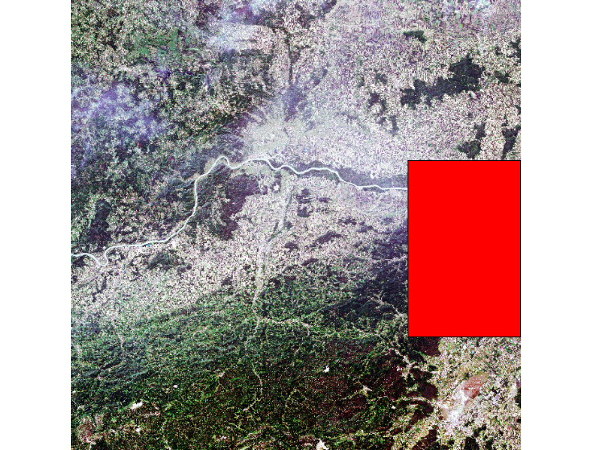

Ein Satellitenbildstack kann in R nur dann erstellt werden, wenn alle Satellitenbilder sowohl dieselbe Pixelgröße als auch dieselbe räumliche Abdeckung haben. Die Pixelgröße ist bei unseren Szenen identisch, da alle Bilder vom selben Satelliten stammen und zu einer einheitlichen Pixelgröße von 10 x 10 m vorprozessiert wurden. Die räumliche Abdeckung passen wir nun an, in dem wir die zwei neuen Satellitenbilder auf das alte Satellitenbild zuschneiden. Dafür nutzen wir folgenden Befehl:

	# crop new images to old
	s2_spring_crop <- crop(s2_spring, s2_winter)
	s2_summer_crop <- crop(s2_summer, s2_winter)

Der "crop()"-Befehl erwartet als ersten Eintrag die Datei, die zugeschnitten werden soll, und als zweiten Input entweder ein "extent"-Objekt, das mit dem Befehl "ext()" von jeder Geodaten-Datei, die mit dem terra-Paket kompatibel ist erstellt werden kann, oder auch einfach eine Geodaten-Datei (Rasterbild oder Vektordatei), aus der der Befehl dann automatisch die extent-Datei ableitet.

Danach können wir die drei Bilder in einen Bilder-Stack zusammenführen indem wir folgenden Befehl ausführen:

	# stack all images
	s2_all <- c(s2_winter, s2_spring_crop, s2_summer_crop)

Würden wir denselben Befehl für die drei Originalbilder durchführen, so würden wir eine Fehlermeldung erhalten.

Wenn wir uns Informationen zum resultierenden Bild ansehen wollen, können wir einfach den Variablennamen eingeben:
	
	s2_all

und sehen nun in der erscheinenden Ausgabe (Abbildung 3), das unser neues Rasterbild nicht nur 10 Kanäle besitzt wir wir für eine einzelne Sentinel-2-Szene erwarnten würden sondern 30 (also die je 10 Kanäle von 3 Bildern übereinandergestapelt). Dies sieht man im Eintrag "size" (markiert mit 1 in Abbildung 3) in dem die Anzahl Zeilen, Spalten und Kanäle bzw. "Layer" angegeben sind.

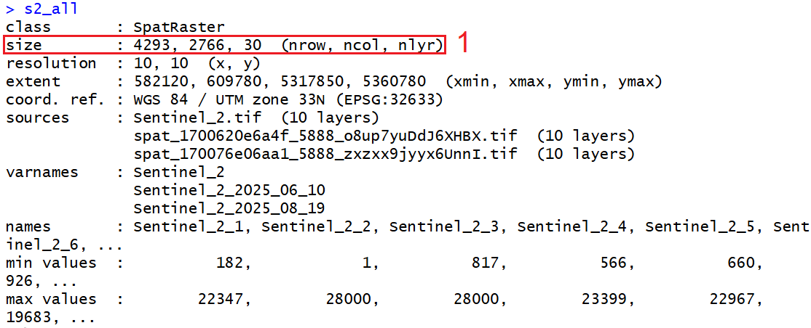

Wir haben nun erfolgreich unseren Raster-Stack erstellt und verwenden diesen nun wie bereits letzte Woche gelernt in einer überwachten Klassifikation. Ich werde die einzelnen Schritte im Folgenden nur sehr knapp erläutern, da wir diese Punkte bereits letzte Woche im Detail durchgesprochen hatten.

##  Teil 2 - Überwachte Klassifikation 

Im Folgenden führen wir nun, wie bereits letzte Woche, die überwachte Klassifikation durch. Wir führen diese zweimal durch; einmal unter Verwendung desselben Bildes wie letzte Woche und einmal mit dem Rasterstack, in dem mehr Information enthalten ist.

Es folgt der Code für das Einzelbild - bitte führen SIe diesen aus und beachten Sie auch die Kommentare im Code, um zu überprüfen, ob sie sich an die jeweiligen Schritte erinnern:

	########################################################
	## SVM Klassifikation mit nur dem ursprünglichen Bild
	########################################################

	# Extraktion der spektralen Information an den Orten der Referenzpunkte
	ref_data_tr <- extract(s2_winter, ref, ID=F)

	# Kopieren der extrahieren Spektren in die Variable "trainval"
	trainval <- ref_data_tr[,1:10]
	# Kopieren der Referenzinformation (die Landbedeckungsklasse jedes Spektrums in die Variable "lc_classes"
	lc_classes <- ref$class

	# Verwendung von "set.seed()" um den Start der Zufallsvariablen festzulegen und damit die Reproduzierbarkeit der Ergebnisse zu gewährleisten
	set.seed(11)
	# Festlegen einer Reihe von gamma und cost Werten, die im Parameter-Tuning verwendet werden, um optimale gamma und cost Werte zu finden
	gammat = seq(.01, .3, by = .01)
	costt = seq(1,128, by = 12)
	# Ansehen der definierten Werte
	gammat
	costt	

	set.seed(25)
	# Durchführen des Parametertunings
	tune1 <- tune.svm(trainval, as.factor(lc_classes), gamma = gammat, cost=costt)
	# Anzeigen des Ergebnisses des Parametertunings
	plot(tune1)

	# Extraktion der bessten gamma und cost Einstellungen
	gamma <- tune1$best.parameters$gamma
	cost <- tune1$best.parameters$cost
	gamma
	cost

	# Trainieren des Modells mit allen Referenzdaten
	svm_model <- svm(trainval, as.factor(lc_classes), gamma = gamma, cost = cost, probability = TRUE)
	# Trainieren des Modells mit einer fünf-fachen Kreuzvalidierung, um einen eindruck von der Klassifikationsgenauigkeit zu erhalten
	svm_model2 <- svm(trainval, as.factor(lc_classes), gamma = gamma, cost = cost, probability = TRUE, cross=5)

	# Abrufen der Klassifikationsgenauigkeit
	summary(svm_model2)

	# Festlegen des Outputs-Ordners !!! Bitte anpassen !!!
	setwd("E:/188_BOKU/02_Lehre/OEKB100130_Remote_Sensing_Landscape_Planning/02_Uebungen/Tag_6/Output")
	# Anwenden des trainierten Modells auf das gesamte Sallitenbild
	svmPred_single <- predict(s2_winter, svm_model, filename="lc_map_svm_tag6.tif", na.rm=TRUE, progress='text', format='GTiff', datatype='INT1U',overwrite=TRUE)

	 # Anzeigen der resultierenden Karte
	plot(svmPred_single)

Wenn alles richtig durchgelaufen ist, sollte am nun die resultierende Klassifikationskarte, die in Abbildung 4 angezeigt ist sichtbar sein.

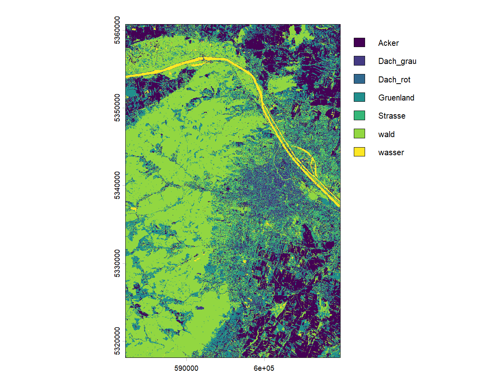

Nun führen wir dieselbe Klassifikation mit dem Satellitenbild-Stack durch. D.h., die einzige Änderung am Code ist das Eingangsbild. Ich habe unten auch jeweils die Variablennamen angepasst, damit man die bereits erstellten Ergebnisse nicht überschreibt:

	########################################################
	## SVM Klassifikation mit dem Satellitenbildstack 
	########################################################

		# Extraktion der spektralen Information an den Orten der Referenzpunkte
	ref_data_tr_all <- extract(s2_all, ref, ID=F)

	# Kopieren der extrahieren Spektren in die Variable "trainval_all"
	trainval_all <- ref_data_tr_all[,1:30]
	# Kopieren der Referenzinformation (die Landbedeckungsklasse jedes Spektrums in die Variable "lc_classes_all"
	lc_classes_all <- ref$class

		# Verwendung von "set.seed()" um den Start der Zufallsvariablen festzulegen und damit die Reproduzierbarkeit der Ergebnisse zu gewährleisten
	set.seed(11)
		# Festlegen einer Reihe von gamma und cost Werten, die im Parameter-Tuning verwendet werden, um optimale gamma und cost Werte zu finden
	gammat = seq(.01, .3, by = .01)
	costt = seq(1,128, by = 12)
	# Ansehen der definierten Werte
	gammat
	costt	

	set.seed(25)
	# Durchführen des Parametertunings
	tune_all <- tune.svm(trainval_all, as.factor(lc_classes_all ), gamma = gammat, cost=costt)
	# Anzeigen des Ergebnisses des Parametertunings
	plot(tune_all)

	# Extraktion der bessten gamma und cost Einstellungen
	gamma_all <- tune_all$best.parameters$gamma
	cost_all <- tune_all$best.parameters$cost
	gamma_all
	cost_all

	# Trainieren des Modells mit allen Referenzdaten
	svm_model_all <- svm(trainval_all, as.factor(lc_classes_all), gamma = gamma_all, cost = cost_all, probability = TRUE)
	# Trainieren des Modells mit einer fünf-fachen Kreuzvalidierung, um einen eindruck von der Klassifikationsgenauigkeit zu erhalten

	svm_model2_all <- svm(trainval_all, as.factor(lc_classes_all), gamma = gamma_all, cost = cost_all, probability = TRUE, cross=5)
	
	# Abrufen der Klassifikationsgenauigkeit
	summary(svm_model2_all)

	# Festlegen des Outputs-Ordners !!! Bitte anpassen !!!
	setwd("E:/188_BOKU/02_Lehre/OEKB100130_Remote_Sensing_Landscape_Planning/02_Uebungen/Tag_6/Output")
	
	# Anwenden des trainierten Modells auf das gesamte Sallitenbild

	svmPred_stack <- predict(s2_all, svm_model_all, filename="lc_map_svm_all.tif", na.rm=TRUE, progress='text', format='GTiff', datatype='INT1U',overwrite=TRUE)

	# Anzeigen der resultierenden Karte
	plot(svmPred_stack)

Wenn der Code erfolgreich durchgelaufen ist, sollte nun der Plot der Landbedeckungskarte für den Satellitenbild-Stack sichtbar sein (Abbildung 5).

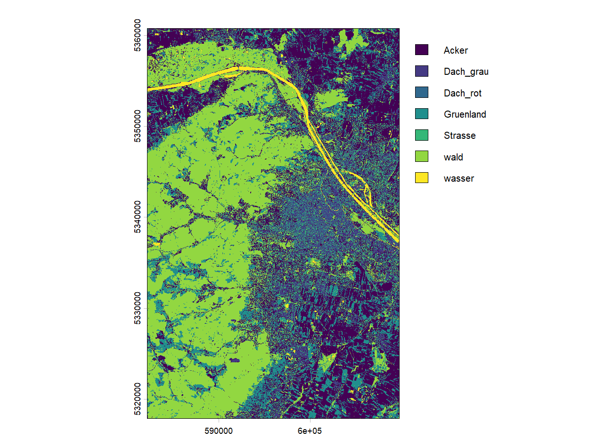

Während des Durchlaufens des Codes wurden bereits die zwei Ergebnisse der Kreuzvalidierungen angezeigt, die wir nun auch nochmal aufrufen, um die Ergebnisse direkt vergleichend gegenüber zu stellen:

	summary(svm_model2)
	summary(svm_model2_all)

Die sollte nun zu des Ausgaben führen wie sie in Abbildung 6 und 7 dargestellt sind:

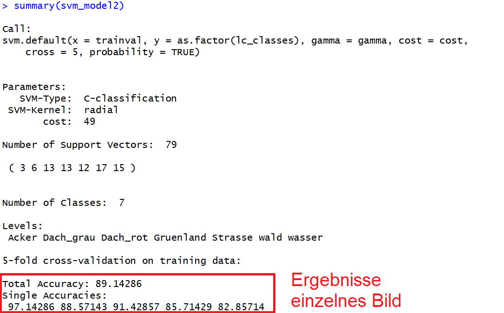

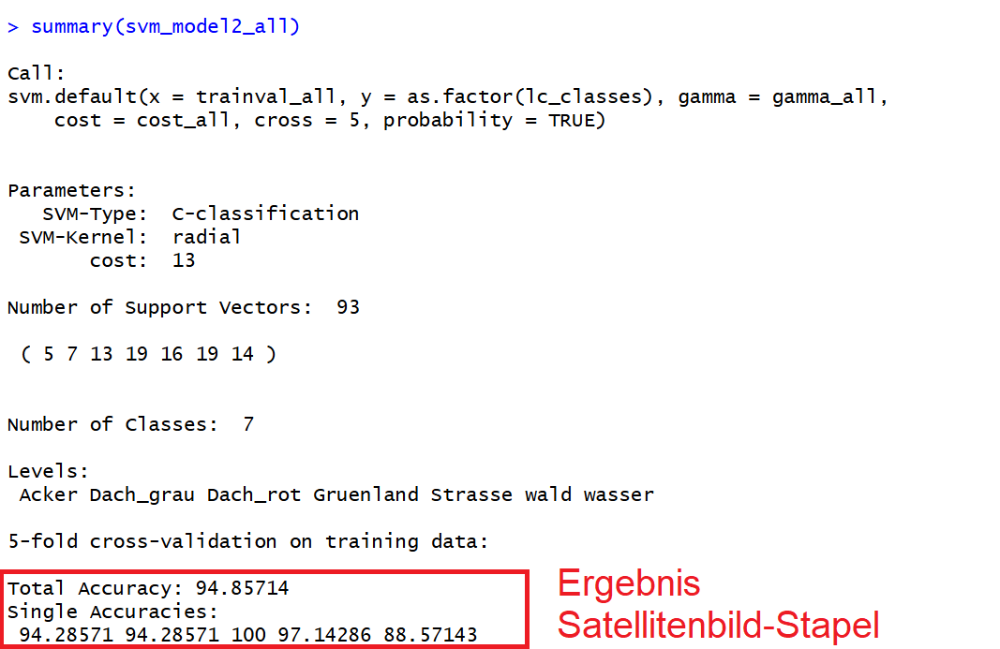

Wir sehen, dass die Ergebnisse der Klassifikation sich leicht von 89.1% auf 94.8% erhöht haben. Da die ursprüngliche Klassifikation bereits recht gut war, ist dieser Sprung um 5.7% doch recht stark. Wir sehen also, dass die Bereitstellung zusätzlicher spektraler Information von Satellitenbildern von anderen Zeitpunkten in unserem konkreten Fall zu einer deutlichen Verbesserung der Gesamtgenauigkeit geführt hat.

Wie bereits heute im theoretischen Teil gehört, ist die Verwendung einer Kreuzvalidierung, so wie oben getan, eine recht vernünftige Validierung für eine überwachte Klassifikation. Der aktuelle Standart, insbesondere auch im Kontext mit sogenannten "Deep-Learning" -Verfahren (die sich sehr stark auf Daten anpassen können) erfordert aber in der Regel noch die zusätzliche Validierung mit einem komplett unabhängigen Test-Datensatz. Diesen Schritt werden wir nun im nächsten Teil des Tutorials kennenlernen.

 ##  Teil 3 - Unabhängige Validierung mit einem Testdatensatz

Um die komplett unabhängige Validierung durchzuführen verwenden wir den neuen Vektordatensatz, der jeweils 30 Validierungspunkte pro Landbedeckungsklasse enthält. Diesen haben wir zu Beginn des Tutorials in die Variable **val** geladen.

Wir nutzen nun den Vektordatensatz, um die Ergebnisklassen in den zwei erstellen Klassifikationskarten an den je 30 Validierungspunkten zu extrahieren. Dafür nutzen wir:

	val_ex_single <- extract(svmPred_single, val, ID=F)
	val_ex_stack <- extract(svmPred_stack, val, ID=F)

Wenn wir uns einen ersten Überblick verschaffen wollen wie die extrahieren Ergebnisse auf die Landbedeckungsklassen verteilt sind können wir folgenden Befehl ausführen:

	table(val_ex_single)
	table(val_ex_stack)

welcher zur Ausgabe, die in Abbildung 8 dargestellt ist führt. Wir sehen nun bereits an dieser Ausgabe, dass die Ergebnisse für die zwei Klassifikationskarten, die wir für das einzelne Satellitenbild und den Satellitenbildstapel erstellt haben, nicht identisch sind.

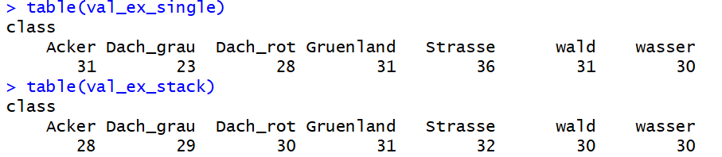

Uns interessieren aber nun nicht nur wie die Landbedeckungsklassen verteilt sind, sondern wir wollen verstehen wie gut die Klassifikationskarten mit den unabhängigen Validierungspunkten übereinstimmen. Dafür wollen wir uns nun eine Konfusionsmatrix anzeigen lassen. Prinzipiell, ist dies mit dem Befehl **confusionMatrix()** aus dem caret-Package möglich. Die Voraussetzung dafür ist, dass wir in den Befehl zwei Datenvektoren (ACHTUNG: Das ist nicht dasselbe wie ein geometrischer Vektordatensatz sondern einfach nur eine Aneinanderreihung von Dateneinträgen - siehe auch den Link zur ersten Einführung in R vom zweiten Tag) im Datenformat "Faktor" liefern und dass die Vektoren dieselben Faktoren bzw. **Levels** (Synonym) enthalten.

Dies klingt nun etwas abstrakt - was bedeutet das für unseren konkreten Fall. Die Vektoren in unserem Fall sind die Informationen zu den Landbedeckungsklassen, also z.B. könnte ein Vektor wie folgt aussehen:

c("Wasser", "Wasser", "Gruenland", "Strasse", "Strasse", "Strasse", "Dach_grau", "Wasser", "Wasser", "Gruenland", "Gruenland"(

Dieser Vektor würde dann die **Faktoren/Levels**: "Wasser", "Gruenland", "Strasse" und "Dach_grau" enthalten.

In unserem Fall haben wir für beide Klassifikationskarten die Vektordatei **ref** für das Training verwendet und die oben extrahierten Landbeckungklassen entsprechen denen, die in **ref** definiert waren (siehe Abbildung 8). Wir wollen nun diese aber mit den Validierungsdaten vergleichen, die in der Vektordatei **val** gespeichert sind. Wie bereits in Abbildung 1 dargestellt, unterscheiden sich hier drei der Landbedeckungsklassen in ihrer Bezeichnung bzw. in der Groß- und Kleinschreibung:

Konkret heissen die drei Klassen in **ref**: "Gruenland", "wasser" und "wald" und in **val**: "Grassland", "Wasser" und "Wald". 

Wenn wir nun versuchen mit dem Befehl:

	confusionMatrix(as.factor(val$class), as.factor(val_ex_single$class))
	confusionMatrix(as.factor(val$class), as.factor(val_ex_stack$class))

uns Konfusionsmatrizen anzeigen zu lassen, so bekommen wir eine Fehlermeldung, die uns mitteilt, dass in einem Vektor **Levels** vorkommen, die im anderen nicht vorkommen (Abbildung 9).

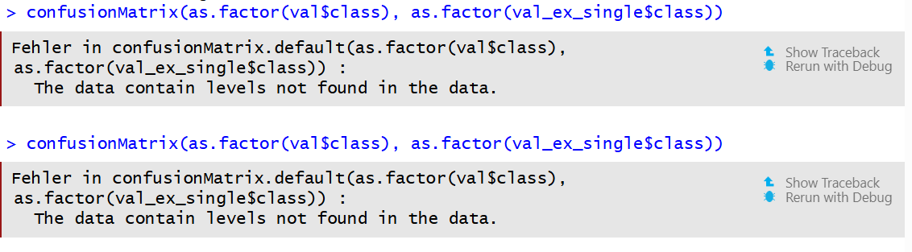

Dies können wir in unserem Fall nur relativ einfach beheben, in dem wir in unserem Vektordatensatz, die entsprechenden Einträge umbenennen. Hierfür verwenden wir folgenden Code:

	val$class[val$class=="Grassland"] <- "Gruenland"
	val$class[val$class=="Wasser"] <- "wasser"
	val$class[val$class=="Wald"] <- "wald"

Dieser kann wie folgt interpretiert werden: Mit **val** rufen wir die Variable/die Vektordatei auf, mit **"\$class"** greifen wir auf die Spalte mit dem Bezeichnung **"class"** in der Attributtabelle zu. Nun nutzen wir - wie bereits gelernt - die eckigen Klammern, um auf bestimmte Einträge innerhalb dieser Spalte zuzugreifen. Konkret nutzen wir dieses mal keine Zeilen, Spalten oder andere Zahlen, die auf die Position des Eintrags hinweisen, sondern wir formulieren eine Bedingung. Die Bedingung lautet: **val\$class=="Grassland"** - d.h., alle Einträge in der Spalte namens "class" die genau dem Eintrag "Grassland" entsprechen werden selektiert. Schließlich wird mit dem Befehl **"<- "Gruenland"** alle Einträge, die durch die Bedingung ausgewählt wurden mit dem Eintrag "Gruenland" überschrieben.

Wenn wir diese Zeilen ausgeführt haben, können wir nun die entsprechenden Konfusionsmatrizen berechnen:

confusionMatrix(as.factor(val$class), as.factor(val_ex_single$class))
confusionMatrix(as.factor(val$class), as.factor(val_ex_stack$class))

Dies führt nun zu zwei sehr ausführlichen Konfusionsmatrizen wo auch direkt eine umfangreiche Zahl an klassenspezifischen Genauigkeiten mitberechnet wurden (Abbildung 10 und 11).

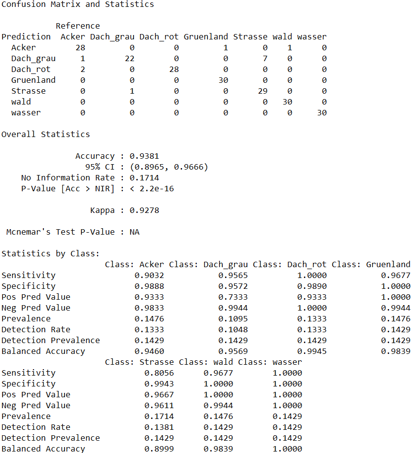

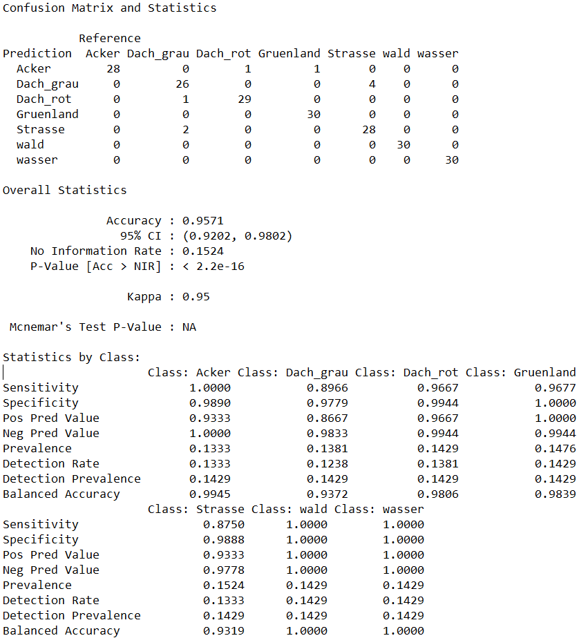

 ##  Teil 4 - Flächenkorrigierte Konfusionsmatrix

Wie in der Vorlesung gehört, ist neben einer unabhängigen Validierung, die Berücksichtigung der Flächenanteile, die die jeweiligen Landbedeckungsklassen in der finalen Karte einnehmen, ein weiterer Faktor, der im Idealfall bei der Validierung einer überwachten Klassifikation berücksichtigt werden sollte. Hintergrund ist, dass wenn bestimmte Klassen sehr große Flächen einnehmen, und andere sehr kleine, bereits eine prozentual sehr geringe Fehlklassifikation zu erheblichen Fehlern führen können. Was ist damit gemeint? Nehmen wir an, wir wollen eine invasive Baumart kartieren und der Einfachheit halber nehmen wir an, dass es in unserer Karte nur drei Klassen gibt: Baumart 1, Baumart 2 und die Invasive Baumart. Wir nehmen an, dass Baumart 1 90% der Fläche einnimmt, Baumart 2 8% und die invasive Art 2%. Insgesamt deckt unser Gebiet 100 km² ab. Wenn jetzt Baumart 1 zu 95% richtig klassifiziert wird (ein sehr guter Wert) aber 5% der Baumart fälschlicherweise in die Klasse "invasive Art" klassifiziert werden dann ergibt sich folgendes Problem: Die invasive Art deckt eigentlich nur 2% des Gesamtgebietes ab, d.h., 2 km². Wenn nun 5% der Klasse Baumart 1, die 9 km² abdeckt fälschlicherweise in die Klasse invasive Art klassifiziert wird, so werden in der Karte weitere 90 km² * 0,05 = 4.5 km² als invasive Art deklariert. d.h., anstatt den eigentlichen 2 km² zeigt unsere Karte eine Bedeckung von 6.5 km² mit der invasiven Art an. Das ist dreimal soviel wie der eigentliche Wert. Dies wäre von einer Managementperspektive ein großes Problem, und das obwohl die Klassifikationsgenauigkeit mit 95% von Baumart 1 eigentlich sehr hoch liegt. Diese Erläuterung ist eine vereinfachte Darstellung des Problems. Es spielen auch noch andere Aspekte wie z.B. die Verteilung und Anzahl der Referenzsamples eine Rolle. In der Vorlesung wurde dies ausführlicher diskutiert.

Wie kann man dieses Problem nun in der Validierung abbilden? Hier bietet sich die Berechnung einer Flächen-adjustierten Konfusionsmatrix an, die wir im folgenden Schritt für Schritt durchgehen werden. Mehr Infos zu diesem Ansatz finden sich in dieser Publikation:

https://samv.elearning.unipd.it/pluginfile.php/175898/mod_resource/content/0/articolo_oloffson.pdf

Wir werden nun in R eine entsprechende Validierung durchführen. Der verwendete Kurs stammt vom online-Kurs RESEDA der Freien Universität Berlin und wurde leicht angepasst, damit der Code mit dem terra-Paket funktioniert:

https://blogs.fu-berlin.de/reseda/area-adjusted-accuracies/
	
Wir beginnen mit der Erstellung einer "normalen" Konfusionsmatrix
	
	# erstelle reguläre Konfusionsmatrix
	confmat <- table(as.factor(val$class), as.factor(val_ex_single$class))

Dann berechnen wir die Anzahl der Pixel jeder Landbedeckungsklasse von unserer bereits erstellten Klassifikationskarten dafür sind einige Schritt notwendig. Der Befehl **values()** extrahiert alle Pixelwerte aus der Klassifikationskarte. Diese sind einfach Werte von 1–7 (für die sieben Landnutzungsklassen)

	imgVal <- as.factor(values(svmPred_single))

Als nächsten Schritt bestimmmen wir die Anzahl an Landbedeckungsklassen in unserer Karte und speichern diese in die Variable **nclass**
	nclass <- length(unique(val$class))
	
Als nächstes zählen wir für jede der Landbedeckungsklassen (in unserem Fall beschrieben durch die Werte 1-7) die Anzahl an pixels. Dafür verwenden wir den **sapply()**-Befehl. Dieser funktioniert ähnlich wie eine for-Schleife. Das bedeutet, eine Funktion (der Teil, der in einer for-Schleife in geschweiften Klammern stehen würde) wird wiederholt angewendet. In diesem Fall zählt die Funktion **sum(imgVal == x)**, wie viele Pixel genau den Wert "x" haben. Dabei nimmt "x" Werte von 1 bis nclass an, mit nclass = 7 in unserem Fall. Die Variable "maparea" enthält am Ende die Anzahl der Pixel jeder Landbedeckungsklasse in unserer Klassifikationskarte

	maparea <- sapply(1:nclass, function(x) sum(imgVal == x))
	
im nächsten Schritt berechnen wir die Fläche, die diesen Pixeln entspricht dazu multiplizieren wir zunächst die Anzahl der Pixel mit der Fläche eines Pixels in unserem Fall ist jedes Pixel 10 m x 10 m = 100 m²; anstatt "res(svmPred_single)[1] * res(svmPred_single)[2]" zu schreiben, was die räumliche Auflösung eines Pixels aus den Metadaten des Rasterbildes bestimmt, könnten wir auch einfach "100" schreiben, aber dann müssten wir den Wert jedes Mal manuell ändern, wenn wir mit einem anderen Satellitenbild mit anderer Auflösung arbeiten. Daher verwenden wir den Vektor "maparea", der die Anzahl der Pixel pro Klasse enthält, multiplizieren ihn mit der Fläche eines einzelnen Pixels (in Quadratmetern) und teilen das Ergebnis schließlich durch 1.000.000, um von Quadratmetern in Quadratkilometer zu skalieren.

	maparea <- maparea * res(svmPred_single)[1] *res(svmPred_single)[2] / 1000000
	
Maparea enthält nun also die Gesamtfläche aller Pixel der 7 Landbedeckungsklassen. Wir können nun die gesamte Kartenfläche berechnen indem wir die Flächen aller Pixel aufsummieren:

	A <- sum(maparea)

Nun können wir die Flächenanteile für jede Klasse, also den prozentualen  Anteil jeder Landbedeckungsklasse in der Karte berechnen:

	W_i <- maparea / A

jetzt berechnen wir die Anzahl der Referenzpunkte pro Klasse die in die jeweilige Landbedeckungklasse klassifiziert wurden (also konkret die Summe aller Einträge in der Zeile der Konfusionsmatrix => gerne auch nochmal die Unterlagen aus der Vorlesung ansehen, um sicherzustellen, dass das gut verstanden ist).

	n_i <- rowSums(confmat) 
	
nun können wir unsere auf Stichprobenpunkten basierende Konfusionsmatrix in eine auf Flächenanteilen basierende Konfusionsmatrix überführen. Dafür multiplizieren wir klassenspezifischen Flächen mit der Konfusionsmatrix und dividieren durch die Anzahl an Referenzpunkten. NA-Werte werden auf 0 gesetzt.

	p <- W_i * confmat / n_i
	p[is.na(p)] <- 0
	
Durch die Multiplikation mit der Gesamtfläche erhalten wir eine Konfusionsmatrix, die Flächen entspricht

	p_a <- p*A
	
wir können uns diese nun anschauen und mit der ursprünglichen Konfusionsmatrix vergleichen

	p_a
	confmat

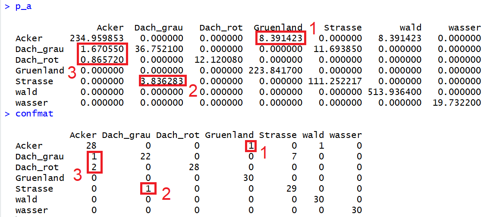

Wie in Abbildung 12 dargestellt entsprechen nun einzelne Einträge in der Konfusionsmatrix bestimmten Flächen in der finalen Karte. Dabei kann man erkennen, dass Fehlklassifikationen von einzelnen Pixeln nicht in dieselbe Flächen übersetzt werden, sondern diese angepasst werden, je nachdem wieviel Fläche die Klasse insgesamt im Bild einnimmt. So sehen wir z.B., dass ein Referenzpunt, der eigentlichen Gruenland ist, falsch in die Klasse Acker klassifiziert wurde (markiert mit 1 in Abbildung 12), ebenso kam es zu einer Misklassifikation eines "Dach_grau" Pixels in die Klasse "Strasse" (markiert mit 2 in Abbildung 12). Da Acker insgesamt deutlich mehr Fläche einnimmt als Strassen, repräsentiert der einzelne falsch klassifizierte Grünland Pixel eine deutlich gößere Fläche (8.40 km²) als im Falle des falsch klassifzierten "Dach_grau"-Pixels (3,84 km²). Dasselbe Prinzip sehen wir auch für Acker-Pixel, die fälschlicherweise in die Klassen "Dach_grau" und "Dach_rot" klassifiziert wurden (markiert mit 3 in Abbildung 12). Je weniger groß die Klasse, in die ein Pixel falsch klassifiziert wurde, desto geringer die Fläche in der flächen-adjustierten Konfusionsmatrix. 

Abschließend können wir noch basierend auf der flächen-adjustierten Konfusionsmatrix die bereits bekannten statistische Kennzahlen berechnen und uns anzeigen lassen:

	# Flächenschätzung
	p_area <- colSums(p) * A
	
	# Gesamtgenauigkeit (Gl. 1)
	OA <- sum(diag(p))
	# Produzenten-Genauigkeit (Gl. 2)
	PA <- diag(p) / colSums(p)
	# Nutzer-Genauigkeit (Gl. 3)
	UA <- diag(p) / rowSums(p)
	
	OA
	PA
	UA

 ##  Teil 5 - Binäre Versiegelungskarte

Als letzten Schritt für unser Tutorial überführen wir nun unsere Landbedeckungskarten mit jeweils 7 Klassen in eine Karte mit nur zwei Klassen, die versiegelte und unversiegelte Gebiete repräsentieren. Dafür müssen wir unsere Raster-Karte reklassifizieren. Ich präsentiere im Folgenden das Vorgehen nur für die Landbedeckungskarte basierend auf dem Satellitenbildstack, die Vorgehensweise ist aber für die Karte basierend auf dem einzelnen Satellitenbild identisch. Nur die Eingangsvariable gan am Anfang des Codes muss verändert werden.

Zuerst schauen wir uns die **Levels** im Raster mit dem **cats()** Befehl an, der in diesem Fall für "Kategorien" steht:

	cats(svmPred_stack)
	
Anschließend speichern wir die Information in einer Matrix namens '**lvl**:

	lvl <- cats(svmPred_stack)[[1]]
	lvl
	
Dann definieren wir die Klassen, die wir als versiegelte Flächen ansehen. Hierfür müssen wir genau die Namen der existierenden klassen verwenden:
 
	# Definition Versiegelungsklassen
	sealed_classes <- c("Dach_grau", "Dach_rot", "Strasse")

Wir erstellen eine neue Spalte in unserer **lvl** Matrix-Variable

	# create new column
	lvl$sealed <- ifelse(lvl$class %in% sealed_classes, 1, 0)
	lvl

Die Matrix entspricht nun sozusagen unserer Übersetzungstabelle. Links sehen wir immer den aktuellen Zahlenwert, der jeder Landbedeckungsklasse entspricht, und recht sehen wir die Zielklasse, in die die Landbedeckungsklasse zugeordnet werden soll (0 = unversiegelt; 1 = versiegelt) (Abbildung)

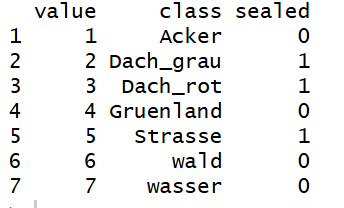

Nun können wir mit dem **classify()**-Befehl diese "Übersetzungstabelle" auf unsere Rasterdatei anwenden: 

	r_bin <- classify(r, rcl = cbind(lvl$value, lvl$sealed))

Wenn können nun das Ergebnis plotten (Abbildung 14):

	plot(r_bin)

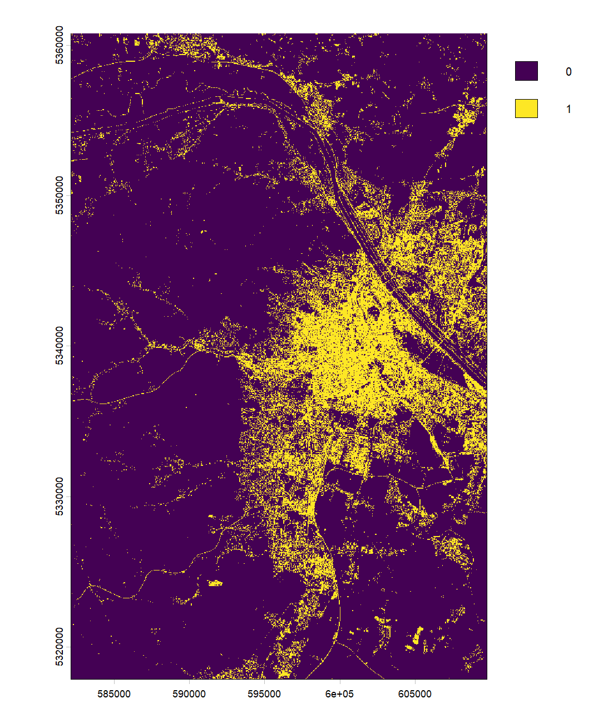

Und schließlich als Geotiff abspeichern:

	writeRaster(r_bin, filename = "sealed_surfaces_stack_S2.tif")

Dieses Geotiff können wir nun in QGIS laden und mit den Google Satellitenbilder vergleichen, um eine zusätzliche Qualitätskontrolle durchzuführen.
